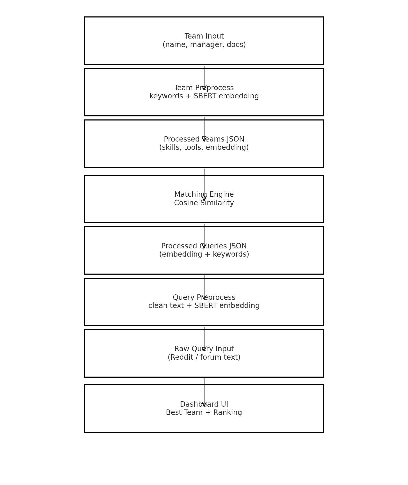

# VectorMatrix – Full Data Flow Documentation

## 📊 System Data Flow Diagram



*(Ensure this PNG is placed beside this README for proper rendering.)*

---

## 🔵 1. Team Input → Team Preprocessing

### Example Team Input
```json
{
  "full_name": "John Doe",
  "email": "john@example.com",
  "team_name": "MPLAB Tools Team",
  "manager_name": "Arjun",
  "documents": [
    "MPLAB X IDE",
    "PIC Programmer ICD4",
    "Embedded Firmware Tools"
  ]
}
```

### Processing Steps
- Combine text fields  
- Extract skills → `["embedded"]`  
- Extract tools → `["mplab", "icd"]`  
- Extract work areas → `["development_tools"]`  
- Generate SBERT embedding (384 dimensions)  

Processed entry is saved to:
```
team_processed_details.json
```

---

## 🔵 2. Raw Query → Processed Query

### Raw Query Example
```json
{
  "title": "enum structire in C for Pic 16f877",
  "content": "I am trying to write firmware...",
  "source": "reddit/pic_programming",
  "url": "https://www.reddit.com/.../enum_structire...",
  "timestamp": 1762885134.0,
  "comments_count": 4
}
```

### Processing Steps
- Clean text  
- Extract keywords → `["c", "embedded"]`  
- Generate SBERT embedding  
- Save to:
```
queries_processed.json
```

---

## 🔵 3. Matching Engine (Cosine Similarity)

The system computes:
```
score = dot(query_emb, team_emb) / (|query_emb| * |team_emb|)
```

### Example Match Output
```json
[
  { "team_name": "MPLAB Tools Team", "score": 0.20 },
  { "team_name": "Automation QA", "score": 0.10 },
  { "team_name": "Embedded Firmware Team", "score": 0.83 }
]
```

Best score → **Embedded Firmware Team**

Saved into:
```
match_results.json
```

---

## 🔵 4. Dashboard UI

### Example Card
```
Query: enum structire in C for Pic 16f877
Assigned Team: Embedded Firmware Team
Score: 83%
Team ID: fc57e7...
Query ID: q-2ea31...
```

Dashboard Features:
- Team logos  
- Score badges  
- Filters  
- Sorting  
- Full ranking page  

---

## 🔵 5. Full Data Flow Summary

```
Teams → Preprocess → Embedding
Queries → Preprocess → Embedding
                ↓
       Matching Engine (SBERT)
                ↓
Dashboard (Best Team + Ranking)
```

---

## 📦 Files Required

Place these files in the same folder:
- `vector_matrix_flow_diagram.png`
- `FULL_DATAFLOW_DOCUMENTATION.md`

---

Done! This .md file is ready for stakeholders and documentation portals.
